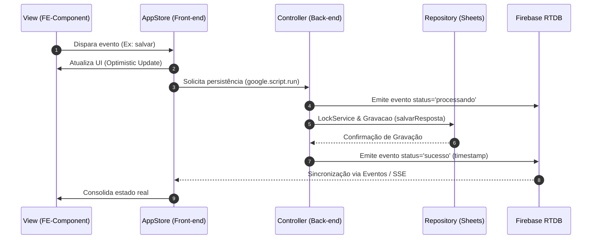

# Sistema de Gerenciamento e Triagem de Tickets

## 1. Arquitetura do Sistema

Este projeto implementa um sistema de gerenciamento de respostas e avaliações, desenhado primariamente para a resolução de questões do ENADE (TechSI Prepare). A arquitetura é construída sobre um ecossistema serverless trilateral que conecta o Google Apps Script (GAS), o Google Sheets e o Firebase Realtime Database.

O propósito da aplicação é fornecer uma interface de página única (SPA) modularizada que gerencia submissões de alunos, permitindo operações de validação, armazenamento de metadados de vídeo, curadoria e geração de rascunhos de e-mail automatizados com baremas de correção.

A arquitetura trilateral funciona da seguinte maneira:

* **Google Apps Script (GAS):** Atua como o motor de back-end (Controladores e Serviços), expondo rotas e executando a lógica de negócios e integrações com o ecossistema Google Workspace (Gmail e Sheets).

* **Google Sheets:** Funciona como o banco de dados principal, através do isolamento de acesso via repositórios (Padrão Repository), garantindo o versionamento tabular e histórico.

* **Firebase Realtime Database:** Atua como um barramento de eventos (Event Bus) focado na sincronização de estado, notificando o front-end em tempo real sobre mudanças ou processamento no back-end.

---

## 2. Fluxo de Dados e Ciclo de Vida (Data Flow)

O front-end adota uma Arquitetura Orientada a Eventos onde a `AppStore` atua como a Fonte Única da Verdade (Single Source of Truth). Para garantir uma experiência de usuário fluida e tolerante a latência, o sistema implementa Atualizações Otimistas (Optimistic UI).

### Passo a Passo de uma Operação de Escrita

1. **Captura de Evento:** A interação do usuário em componentes modulares (ex: `FE-Component-Modals-CorrigirPreCuradoria.html`) aciona um handler de evento.

2. **Atualização da Store (Atualização Otimista):** O evento invoca o método de atualização na Store global (ex: `window.AppStore.atualizarTicket(resposta.ticket, novosCampos)`). O estado local é alterado e a interface reage instantaneamente.

3. **Chamada de API/GAS:** A Store despacha, de forma assíncrona, a requisição para o back-end via `google.script.run` (ex: `salvarRespostaENotificar`).

4. **Processamento e Atualização da Planilha:** O back-end em GAS recebe o payload, delega ao serviço (`RespostaService`), obtém um lock de concorrência (`LockService`) e persiste as mudanças através do `RespostaRepository` na aba `Gerenciamento_Respostas`.

5. **Disparo no Firebase:** Simultaneamente à persistência, o `FirebaseNotifier` despacha eventos transacionais para o nó `/ultimo_evento.json` no Firebase (emitindo status de `processando`, `sucesso` ou `erro`). O front-end, escutando estas alterações, consolida a atualização ou efetua o rollback caso ocorra falha.

### Diagrama de Fluxo de Dados

---

## 3. Estrutura MVC e Organização do Código

O projeto implementa uma separação rigorosa de responsabilidades baseada no Padrão MVC (Model-View-Controller), reforçada pelo padrão de Repositórios e Serviços de Domínio.

### Mapeamento das Responsabilidades

* **Model (Domínio e Estruturas de Dados):**
* Classes como `Prova`, `Questao`, `Reenvio`, `Resposta` e `EmailDraft` encapsulam o formato e regras restritas dos dados.
* Centralizam rotinas utilitárias de formatação, como processamento de datas e geração de links específicos (ex: `_gerarVerQuestaoSite`).

* **View (Componentes de Apresentação):**
* Arquitetura modularizada em arquivos `.html`, contendo escopos isolados (IIFE) e CSS injetado dinamicamente no `head`.
* Exemplos: `FE-Component-Barema.html` renderiza critérios de correção. `FE-Component-Buttons.html` padroniza componentes de ação iterativos.

* **Controller (Ponto de Entrada e Roteamento):**
* Arquivos como `BE-Controller-Spreadsheet.js`, `BE-Controller-Gmail.js` e `BE-Controller-Config.js` orquestram o tráfego.
* Expostos diretamente para uso do front-end, eles invocam camadas inferiores e não mantêm lógica de negócios densa.

* **Store (Gerenciamento de Estado):**
* Isolada no front-end (`window.AppStore`), garante que os componentes da View não manipulem dados brutos ou chamadas diretas não orquestradas.

* **Services & Repositories (Integração e Persistência):**
* **Repositories:** Herdam de `BaseSpreadsheetRepository` para encapsular a lógica da Google Sheets API, mapeando linhas em instâncias dos Models e vice-versa (`ProvaRepository`, `QuestaoRepository`, `RespostaRepository`).

* **Services:** Controlam orquestrações complexas. O `GmailService` lida com a busca de *threads* e geração de rascunhos de resposta baseados em metadados da submissão. O `FirebaseNotifier` abstrai requisições `UrlFetchApp` direcionadas ao endpoint REST do Firebase.

### O Papel do Firebase e o Motor GAS

O Firebase funciona estritamente como um hub de notificação transacional. Ele não persiste permanentemente os dados do negócio; ele armazena payloads temporários efêmeros (ticket de referência, sessionId, status, timestamp) para contornar a limitação do GAS de não suportar Server-Sent Events (SSE) ou WebSockets de forma nativa. O GAS opera como o verdadeiro motor de back-end autoritativo, validando a integridade das persistências e aplicando regras de trava mecânica (`LockService.getScriptLock`) em operações simultâneas de escrita na planilha.

---

## 4. Tecnologias e Integrantes do Ecossistema

As seguintes tecnologias estruturam a base do projeto:

* **Google Apps Script (V8 Engine):** Back-end serverless, utilizando JavaScript moderno (ES6+).
* **Google Sheets API:** Persistência estruturada, utilizando abstrações nativas do GAS (`SpreadsheetApp`, `LockService`).
* **Google Gmail API:** Criação e busca de rascunhos encadeados por ticket de atendimento (`GmailApp`).
* **Firebase Realtime Database:** Barramento REST de comunicação pub/sub simplificado.
* **Vanilla Front-end (HTML5, CSS3, JavaScript ES6+):** Renderização de componentes injetados, sem bibliotecas pesadas externas (zero-dependency approach), processados através do `HtmlService.createTemplateFromFile`.

---

## 5. Guia de Configuração e Instalação

### Instalação no Ambiente (Google Apps Script)

1. **Via IDE Web do GAS (Importação Manual):**
* Acesse `Extensions > Apps Script` a partir de uma Planilha Google.
* Crie os arquivos correspondentes utilizando o mesmo esquema de nomes estruturais (ex: `BE-Controller-Config.gs`, `FE-Component-Barema.html`).
* Copie e cole o conteúdo de cada arquivo respectivo.

### Configuração de Variáveis de Ambiente (Script Properties)

O sistema depende de chaves estritas armazenadas com segurança via `PropertiesService`. Navegue até as *Configurações do Projeto (ícone de engrenagem)* na interface web do Apps Script e adicione as seguintes **Propriedades do Script**:

* `SPREADSHEET_ID`: ID alfanumérico da planilha Google vinculada onde os repositórios atuarão.
* `FIREBASE_DB_URL`: Endpoint raiz do Firebase Realtime Database (Ex: `https://<nome-projeto>.firebaseio.com`).
* `FIREBASE_SECRET`: Chave ou Token de acesso restrito (Database Secret) para permitir operações de escrita via REST.
* `FORM_REENVIO_URL`: (Opcional) Link de fallback utilizado na renderização dos rascunhos HTML em `FE-Component-Barema.html`.
* `URL_REPOSITORIO`: (Opcional) Referência da origem do software ou documentação externa.

Finalizada a configuração, execute a rotina de validação abrindo o arquivo `BE-Test.js` na interface e rodando a função `executarTodasAsValidacoes()` para atestar a estabilidade dos módulos, injeção de propriedades e comunicação externa.