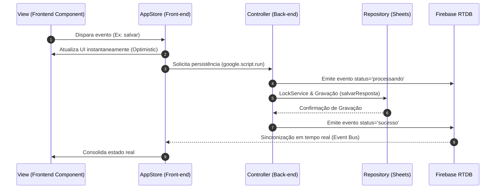

# Sistema de Gerenciamento e Triagem de Tickets

## 1. Arquitetura do Sistema

Este projeto implementa um sistema de gerenciamento de respostas e avaliações, desenhado primariamente para a resolução de questões do ENADE (TechSI Prepare). A arquitetura é construída sobre um ecossistema serverless trilateral que conecta o **Google Apps Script (GAS)**, o **Google Sheets** e o **Firebase Realtime Database**.

O propósito da aplicação é fornecer uma interface de página única (SPA) modularizada que gerencia submissões de alunos, permitindo operações de validação, armazenamento de metadados de vídeo, curadoria e geração de rascunhos de e-mail automatizados com baremas de correção.

* **Google Apps Script (GAS):** Motor de back-end (Controllers e Services), expondo rotas e executando a lógica de negócios e integrações com o ecossistema Google Workspace (Gmail e Sheets).
* **Google Sheets:** Banco de dados principal acedido via padrão Repository (`backend/repositories`), garantindo versionamento tabular e histórico.
* **Firebase Realtime Database:** Barramento de eventos (Event Bus) focado na sincronização de estado, notificando o front-end em tempo real sobre mudanças no back-end.

---

## 2. Estrutura do Projeto

O projeto adota uma estrutura modular baseada em responsabilidades:

```text
response-lifecycle-management/
├── backend/
│   ├── controllers/      # Handlers expostos ao front-end (Config, Gmail, Spreadsheet)
│   ├── models/           # Entidades de domínio (Prova, Questão, Resposta, Reenvio, EmailDraft)
│   ├── repositories/     # Camada de acesso à Google Sheets API (Base, Provas, Questoes, etc.)
│   ├── services/         # Regras de negócio e integrações (Firebase, Gmail, Provas, Respostas)
│   └── tests/            # Suíte de testes e validação interna
├── frontend/
│   ├── components/       # Componentes visuais UI em HTML/JS/CSS
│   │   └── modals/       # Modais de interface (CorrigirPreCuradoria, EnviarBarema, etc.)
│   ├── services/         # Listeners e conexões front-end (FirebaseListener)
│   ├── store/            # Gerenciamento de estado otimista (AppStore)
│   └── Index.html        # Ponto de entrada da interface
├── bundler.py             # Script de empacotamento automático para o Apps Script
└── README.md
```

---

## 3. Fluxo de Dados e Ciclo de Vida (Data Flow)

O front-end adota uma Arquitetura Orientada a Eventos onde a `AppStore` atua como a Fonte Única da Verdade (Single Source of Truth) com **Atualizações Otimistas (Optimistic UI)**.



---

## 4. Empacotamento e Implantação (Bundler & Apps Script)

O Google Apps Script nativamente não suporta estruturas complexas de pastas aninhadas nem imports de módulos ES6 em arquivos `.html` separados sem inlining. Para manter a codebase limpa e modular durante o desenvolvimento, utilizamos o **`bundler.py`**.

O bundler consolida o projeto em apenas **2 arquivos finais**:
* `bundled_backend.gs`: Garante a ordem correta de declaração das classes e módulos (Models -> Repositories -> Services -> Controllers -> Tests).
* `bundled_frontend.html`: Resolve recursivamente todas as tags `<?!= include('...') ?>` e embute os componentes na interface.

### Como Executar o Bundler

Certifique-se de ter o Python 3 instalado no seu ambiente local e execute:

```bash
python bundler.py
```

*Se estiver executando no Windows Command Prompt/PowerShell e encontrar problemas de encoding de caracteres, utilize:*

```bash
python bundler.py
```
*(O script utiliza codificação UTF-8 por padrão em todas as leituras e escritas).*

### Como Adicionar ao Google Apps Script (Manual)

1. Abra o projeto Apps Script existente.
2. Na barra lateral esquerda do Apps Script, crie exatamente **2 arquivos**:
   - Um arquivo de **Código** (`.gs`) nomeado `bundled_backend` (ou `Code`).
   - Um arquivo **HTML** (`.html`) nomeado `bundled_frontend` (ou `Index`).
3. Copie o conteúdo gerado em `bundled_backend.gs` no seu ambiente local e cole no arquivo de código do Apps Script.
4. Copie o conteúdo gerado em `bundled_frontend.html` e cole no arquivo HTML do Apps Script.
5. Salve o projeto (`Ctrl + S` / `Cmd + S`).

---

## 5. Configuração de Variáveis de Ambiente (Script Properties)

No painel do Apps Script, navegue até **Configurações do Projeto** (ícone de engrenagem) e adicione as seguintes **Propriedades do Script (Script Properties)**:

| Propriedade | Descrição | Exemplo |
| :--- | :--- | :--- |
| `SPREADSHEET_ID` | ID alfanumérico da planilha Google vinculada. | `1BxiMVs0XRZr...` |
| `FIREBASE_DB_URL` | Endpoint raiz do Firebase Realtime Database. | `https://seu-projeto.firebaseio.com` |
| `FIREBASE_SECRET` | Secret/Token de acesso para operações REST no Firebase. | `AIzaSy...` |
| `FORM_REENVIO_URL` | *(Opcional)* Link de fallback para formulário de reenvio nos e-mails. | `https://forms.gle/...` |
| `URL_REPOSITORIO` | *(Opcional)* Link de referência da documentação ou repositório. | `https://github.com/...` |

---

## 6. Validação do Sistema

Após colar os bundles e configurar as propriedades no Apps Script:
1. No editor do Apps Script, selecione a função `executarTodasAsValidacoes` localizada ao final do arquivo de código (`bundled_backend.gs`).
2. Clique em **Executar**.
3. Verifique os logs de execução no console para confirmar se as integrações com a planilha, Firebase e Gmail foram concluídas sem erro.